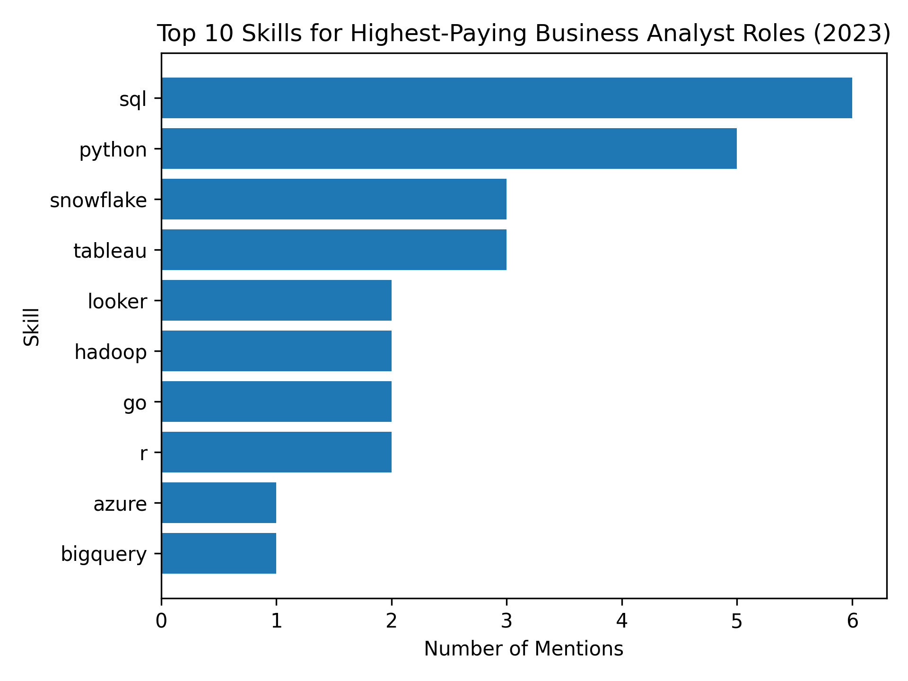

# Introduction
Dive into the data job market! Focusing on business analyst roles. This project explores top-paying jobs, in-demand skills, and where high demand jobs meets high salary in business analytics

SQL queries? Check them out here: [Project_sql](/Project_sql/)

# Background
Driven by a quest to help young professionals navigate the business analyst job market more effectively, this project was born from a desire to pinpoint top-paid and in-demand skills, streamlining others work to find optimal jobs

Data hails from my a source in Kaggle. It's packed with insights on job titles, salaries, locations, and essential  skills.

### The questions I wanted to answer through my SQL queries were:

1. What are the top-paying business analyst jobs for young professionals?
2. What skills are required for these top-paying jobs?
3. What skills are most in demand for business analysts?
4. Which skills are associated with higher salaries?
5. What are the most optimal skills to learn?

# Tools I Used
For my deep dive into the business analyst job market, I harnessed the power of several key tools:

- **SQL:** The backbone of my analysis, allowing me to query the database and unearth critical insights
- **PostgreSQL:** The chosen database management system, ideal for handling the job posting data.
- **Visual Studio Code:** My go-to for database management and executing SQL queries.
- **Git & GitHub:** Essential for version control and sharing my SQL Scripts and analysis, ensuring collaboration and project tracking.

# The Analysis
Each query for this project aimed at investigating specific aspects of the business analyst job market. Here's how I approached each question:

### 1. Top Paying Business Analyst Jobs
To identify the highest-paying roles, I filtered business analyst positions by average yearly salary and location. This query highlights the high paying opportunities in the filed.

```sql
SELECT
    job_id,
    job_title_short,
    job_location,
    job_schedule_type,
    salary_year_avg,
    job_posted_date,
    name AS employer_name
FROM
    job_postings_fact
    LEFT JOIN
        company_dim ON job_postings_fact.company_id = company_dim.company_id
WHERE
    job_title_short ILIKE '%Business Analyst%' AND
    salary_year_avg IS NOT NULL AND
    job_location IS NOT NULL
ORDER BY
    salary_year_avg DESC
LIMIT 10;
```
Here's the breakdown of the top business analyst jobs in 2023:

- **Wide salary range:** Top offers span ~$387k (Roblox) down to ~$173k (CVS), a ~$214k gap, showing large pay dispersion even within “Business Analyst” roles.

- **Diverse employers:** Mix of consumer tech (Roblox, Uber), health/fitness tech (Noom), crypto investing (Multicoin Capital), fintech/blockchain (Block), e-commerce (Amazon), financial services/insurance (USAA, CVS), plus analytics consultancy (Harnham).

- **Job title variety (limited):** All listings use the short title “Business Analyst”; the variety comes from employer domain and geography (San Mateo/SF Bay Area, Madrid, Charlotte, Irving, multiple remote “Anywhere” roles), not from different analyst titles.

### 2. Top Paying Business Analyst skills
To Understand what skills are required for the top-paying business analyst jobs. here i joined the job postings with the skills data, providing insights into what employers value for high-compensation roles

```sql
WITH top_paying_job AS (
    SELECT
        job_id,
        job_title_short,
        job_location,
        job_schedule_type,
        salary_year_avg,
        name AS employer_name
    FROM
        job_postings_fact
        LEFT JOIN
            company_dim ON job_postings_fact.company_id = company_dim.company_id
    WHERE
        job_title_short ILIKE '%Business_Analyst%' AND
        salary_year_avg IS NOT NULL AND
        job_location IS NOT NULL
    ORDER BY
        salary_year_avg DESC
    LIMIT 10
)
SELECT
    top_paying_job.*,
    skills
FROM
    top_paying_job
    INNER JOIN
        skills_job_dim ON top_paying_job.job_id = skills_job_dim.job_id
    INNER JOIN
        skills_dim ON skills_job_dim.skill_id = skills_dim.skill_id
ORDER BY
    top_paying_job.salary_year_avg DESC;
```
Here's the breakdown of the most demand skills for business analyst in 2023, based on job postings:


*Bar graph visualizing the number of time a skills is mentioned for the top 10 highest paying business analyst jobs; ChatGPT generated this graph from my SQL query results*

- **SQL** is leading by 6 mentions
- **Python** follows closely with 5 mentions
- Other skills like **tableau** and **Snowflake** show varying degree of demand 
Its interesting that Excel was not among the top skills

### 3. In-Demand Skills for Business Analyst
This query helped identify the skills most frequently requested in job postings, directing focus to areas with high demand

```sql
SELECT
    skills,
    COUNT(skills_dim.skill_id) AS skill_demand_count
FROM
    job_postings_fact
    INNER JOIN
        skills_job_dim ON job_postings_fact.job_id = skills_job_dim.job_id
    INNER JOIN
        skills_dim ON skills_job_dim.skill_id = skills_dim.skill_id
WHERE
    LOWER(job_postings_fact.job_title) LIKE LOWER('%business analyst%')
GROUP BY
    skills
ORDER BY
    skill_demand_count DESC
LIMIT 10;
```
Here is the breakdown of the most demanded skills for business analyst in 2023
- **SQL** and **Excel** remain fundamental, emphasizing the need for strong foundational skills in data processing and spreadsheet manipulation.
- **programming** and **visualization Tools** like **Python**,**Tableau**, and **Power BI** are essential, pointing towards the increasing importance of technical skills in data storytelling and decision support.

| Skill      | Demand Count |
|------------|--------------|
| sql        | 4827         |
| excel      | 4105         |
| tableau    | 2203         |
| power bi   | 2028         |
| python     | 1768         |
| powerpoint | 1198         |
| sap        | 969          |
| word       | 955          |
| r          | 896          |
| jira       | 892          |

*Table of the demand for the top 10 skills in business analyst job postings*

### 4. Skills Based on Salary
Exploring the average salaries associated with different skills revealed which skills are the highest paying.

```sql
SELECT
    skills,
    ROUND(AVG(salary_year_avg), 0) AS avg_salary
FROM
    job_postings_fact
    INNER JOIN
        skills_job_dim ON job_postings_fact.job_id = skills_job_dim.job_id
    INNER JOIN
        skills_dim ON skills_job_dim.skill_id = skills_dim.skill_id
WHERE
    LOWER(job_postings_fact.job_title) LIKE LOWER('%business analyst%')
    AND salary_year_avg IS NOT NULL    
GROUP BY
    skills
ORDER BY
    avg_salary DESC
LIMIT 25;
```
Here is the breakdown of the results for top paying skills for Business Analyst
- Top salaries cluster around **big data** and **cloud tools** like Scala, Databricks, Hadoop, GCP
- **Modelling and statistical depth** also command higher compensation in skills like PyTorch, TensorFlow, MATLAB
- Knowledge of **data governance** and **enterprise environment** like GDPR, Unix, and Shell is rewarded because roles influence compliance, scalability and decision making at organizational level.

| Skill         | Avg Salary |
|---------------|------------|
| scala         | 135,000    |
| gcp           | 135,000    |
| gdpr          | 125,867    |
| databricks    | 122,500    |
| hadoop        | 120,375    |
| spss          | 120,000    |
| matplotlib    | 120,000    |
| matlab        | 120,000    |
| pytorch       | 120,000    |
| scikit-learn  | 120,000    |
| seaborn       | 120,000    |
| tensorflow    | 120,000    |
| react         | 117,500    |
| java          | 115,000    |
| azure         | 114,643    |
| sas           | 111,667    |
| aws           | 109,907    |
| unix          | 109,447    |
| mysql         | 107,591    |
| phoenix       | 107,591    |
| shell         | 106,670    |
| bitbucket     | 105,750    |
| ssis          | 104,504    |
| slack         | 100,500    |
| swift         | 98,932     |

*Table of the average salary for the top 25 paying skills for business analyst*

### 5. Most Optimal Skills to Learn
Combining insights from demand and salary data, this query aimed to pinpoint skills that are both in high demand and have high salaries, offering a strategic focus for skill development.

```sql
    WITH High_Demand_Skills AS (
        SELECT
            skills_dim.skill_id,
            skills_dim.skills,
            COUNT(skills_job_dim.skill_id) AS skill_demand_count
        FROM
            job_postings_fact
            INNER JOIN
                skills_job_dim ON job_postings_fact.job_id = skills_job_dim.job_id
            INNER JOIN
                skills_dim ON skills_job_dim.skill_id = skills_dim.skill_id
        WHERE
            LOWER(job_postings_fact.job_title) LIKE LOWER('%business analyst%')
            AND salary_year_avg IS NOT NULL 
        GROUP BY
            skills_dim.skill_id
),
    High_Paying_Skills AS (
        SELECT
            skills_job_dim.skill_id,
            ROUND(AVG(salary_year_avg), 0) AS avg_salary
        FROM
            job_postings_fact
            INNER JOIN
                skills_job_dim ON job_postings_fact.job_id = skills_job_dim.job_id
            INNER JOIN
                skills_dim ON skills_job_dim.skill_id = skills_dim.skill_id
        WHERE
            LOWER(job_postings_fact.job_title) LIKE LOWER('%business analyst%')
            AND salary_year_avg IS NOT NULL    
        GROUP BY
            skills_job_dim.skill_id
)

SELECT
    High_Demand_Skills.skills,
    High_Demand_Skills.skill_demand_count,
    High_Paying_Skills.avg_salary
FROM
    High_Demand_Skills
    INNER JOIN
        High_Paying_Skills ON High_Demand_Skills.skill_id = High_Paying_Skills.skill_id
ORDER BY
    High_Demand_Skills.skill_demand_count DESC,
    High_Paying_Skills.avg_salary DESC
LIMIT 25;


-- Rewriting this same query more concisely without CTEs
SELECT
    skills_dim.skills,
    COUNT(skills_job_dim.job_id) AS demand_count,
    ROUND(AVG(job_postings_fact.salary_year_avg), 0) AS avg_salary
FROM
    job_postings_fact
    INNER JOIN
        skills_job_dim ON job_postings_fact.job_id = skills_job_dim.job_id
    INNER JOIN
        skills_dim ON skills_job_dim.skill_id = skills_dim.skill_id
WHERE
    LOWER(job_postings_fact.job_title) LIKE LOWER('%business analyst%')
    AND job_postings_fact.salary_year_avg IS NOT NULL
GROUP BY
    skills_dim.skill_id
ORDER BY
    demand_count DESC,
    avg_salary DESC
LIMIT 25;
```

| Skill        | Demand Count | Avg Salary |
|--------------|--------------|------------|
| sql          | 65           | 87,805     |
| excel        | 50           | 79,093     |
| tableau      | 35           | 90,920     |
| power bi     | 29           | 94,560     |
| python       | 20           | 94,045     |
| flow         | 18           | 90,133     |
| powerpoint   | 18           | 74,275     |
| word         | 15           | 73,369     |
| r            | 12           | 87,597     |
| sap          | 9            | 93,034     |
| oracle       | 8            | 89,967     |
| visio        | 8            | 85,285     |
| outlook      | 8            | 79,288     |
| azure        | 7            | 114,643    |
| vba          | 7            | 90,202     |
| ssrs         | 6            | 96,677     |
| sql server   | 6            | 93,864     |
| jira         | 6            | 75,533     |
| ssis         | 5            | 104,504    |
| confluence   | 5            | 80,500     |
| aws          | 4            | 109,907    |
| gdpr         | 3            | 125,867    |
| sas          | 3            | 111,667    |
| sas          | 3            | 111,667    |
| unix         | 3            | 109,447    |

*Table of the most optimal skills for business analyst sorted by salary*

Here's a breakdown of the most optimal skills for Business Analyst in 2023:

- **High-Demand Programming Languages:** SQL is the non-negotiable baseline (65 postings) anchoring BA workflows; Python adds automation, modeling, and API coverage with strong pay (~$94k) for teams modernizing beyond spreadsheets.
- **Cloud Tools and Technologies:** Azure and AWS are force multipliers with fewer postings but top-tier salaries ($114k/$110k) because cloud data stacks (storage, compute, IAM) power scalable analytics and self-serve BI.
- **Business Intelligence and Visualization Tools:** Tableau and Power BI pair strong demand (35/29) with high pay (~$91k–$95k), while Excel (50 postings) endures for ad-hoc analysis, quick dashboards, and stakeholder handoffs.
- **Database Technologies:** SQL Server plus ETL/reporting companions (SSIS/SSRS) form a stable enterprise backbone with higher salaries (~$96k–$104k); warehouse patterns (pipelines, scheduling, monitoring) make these skills especially sticky.

# What I Learned
Throughout this adventure, I've turbocharged my SQl toolkit with some serious firepower:

- **Complex Query Crafting:** Mastered the art of advanced SQL, merging tables like a pro and wielding WITH clauses for ninja-level temp table maneuvers.
- **Data Aggregation:** Got cozy with GROUP BY and turned aggregate functions like COUNT() and AVG() into my data-summarizing sidekicks.
- **Analytical wizardry:** Leveled up my real-world puzzle-solving skills, turning questions into actionable, insightful SQL queries.

# Conclusion
### Insights
From the analysis, several general insights emerged:

1. **Wide Salary Range in Top-Paying Business Analyst Jobs**: The highest-paying roles show significant variation, with salaries ranging from approximately $387,000 (at Roblox) down to $173,000 (at CVS), indicating a $214,000 gap even within similar "Business Analyst" titles.

2. **Diverse Employer Landscape**: Top-paying opportunities come from a mix of industries, including consumer tech (e.g., Roblox, Uber), health/fitness tech (Noom), crypto/fintech (Multicoin Capital, Block), e-commerce (Amazon), financial services (USAA, CVS), and analytics consulting (Harnham), highlighting broad career options.

3. **SQL Dominates Skills for Top-Paying Jobs**: Among the skills required for the top 10 highest-paying Business Analyst positions, SQL leads with 6 mentions, underscoring its critical importance for high-compensation roles.

5. **Python as a Strong Contender**, ***Excel Surprisingly Absent***: Python follows closely with 5 mentions for top-paying jobs, while other skills like Tableau and Snowflake show moderate demand; notably, Excel—often considered a staple for analysts—is not among the top skills, suggesting a shift toward more advanced tools.e force multipliers with fewer postings but top-tier salaries ($114k/$110k) because cloud data stacks (storage, compute, IAM) power scalable analytics and self-serve BI.

### Closing Thoughts
This project further enhanced my SQL skills and provided valuable insights for those venturing into the business analyst job market. The findings from the analysis serves as a guide to prioritizing skills development and job search efforts. Aspiring business and even data analyst can better position themselves in a competitive job market by focusing on high-demand, high-salary skills. This exploration highlights the importance of continuous learning and adaptation to emerging trends in the field of business analytics.